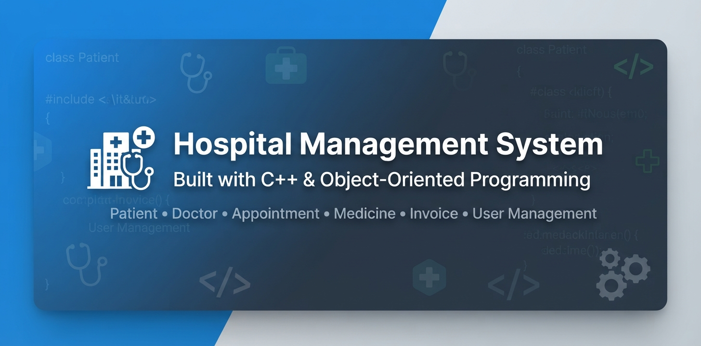

# 🏥 Hospital Management System



> A comprehensive console-based Hospital Management System built in C++ applying Object-Oriented Programming principles and efficient file handling.


---

## 📖 Overview

This project is a complete Hospital Management System developed as a learning journey in C++. It demonstrates a strong understanding of:

- Object-Oriented Programming (OOP)
- Mix between **Structures** and **Classes**
- Data type optimization and memory efficiency
- File handling for data persistence
- Modular architecture with 100+ header files
- Responsive interaction between multiple screens

---

## ✨ Features

### 👤 Patient Management
- Add, Update, Delete, Find, and List Patients
- Patient Medical History tracking

### 👨‍⚕️ Doctor Management
- Add, Update, Delete, Find, and List Doctors
- Specialization-based filtering
- Available slots display

### 📅 Appointment Management
- Book, Update, Delete, and Find Appointments
- Today's Appointments view
- Doctor-specific appointments

### 💊 Medicine Management
- Add, Update, Delete, Find, and List Medicines

### 🧾 Invoice Management
- Create, Update, Delete, and List Invoices

### 👥 User Management
- Add, Update, Delete, Find, and List Users
- Authentication system (Login / Register)
- Role-based permissions

### 💱 Currency Exchange
- Currency list and exchange calculator
- Currency rate updates

### 🏦 Banking Operations
- Deposit and Withdraw screens
- Transfer operations and transfer logs
- Total balances view

---

## 🛠️ Technical Highlights

| Aspect | Description |
|--------|-------------|
| **Language** | C++ |
| **Paradigm** | Object-Oriented Programming |
| **Architecture** | Modular, 100+ header files |
| **Data Persistence** | File Handling (TXT files) |
| **Design** | Mix of `struct` and `class` for optimal use |
| **Optimization** | Careful data type selection for memory efficiency |
| **UI** | Console-based with responsive, interconnected screens |

---

## 🚀 How to Run

### Prerequisites
- **Visual Studio 2022** (recommended)
- **C++ Compiler** (MSVC)

### Steps

1. **Clone the repository:**
   ```bash
   git clone https://github.com/Mahmoud-Alkhatib1/Hospital-Management-System-Cpp.git